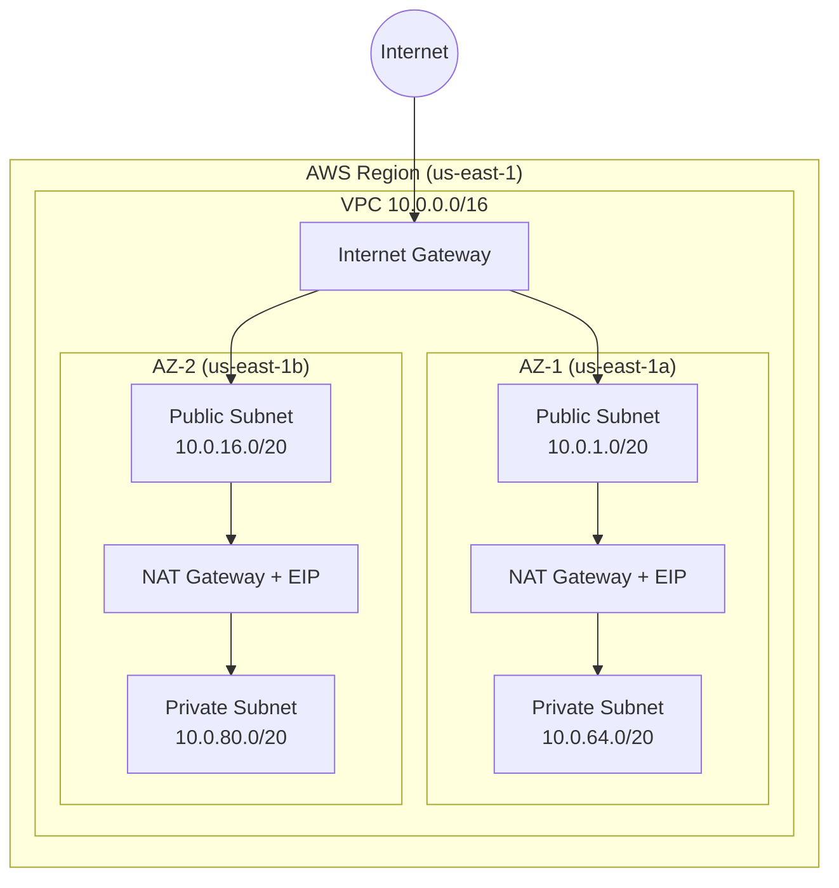

# ADR-0001: Networking Stack - VPC Multi-AZ com Subnets Publicas e Privadas

## Status
Proposed

## Data
2026-05-23

## Contexto
O projeto dvn-workshop-maio necessita de uma stack de networking provisionada via Terraform que sirva como fundacao para workloads em AWS. A stack anterior (01-networking-stack) continha apenas uma VPC basica com CIDR 10.0.0.0/16, sem subnets, sem Internet Gateway, sem NAT Gateway e sem segmentacao de rede. Este ADR documenta as decisoes arquiteturais para uma nova stack (01-networking-stack-ai) que segue as melhores praticas do AWS Well-Architected Framework, validadas via AWS MCP Server (skill: creating-production-vpc-multi-az) e documentacao oficial da AWS.

## Drivers da Decisao
- Necessidade de subnets publicas e privadas em multiplas AZs para alta disponibilidade
- Boas praticas do AWS Well-Architected Framework validadas via AWS MCP
- Segmentacao de rede para separar workloads publicos e privados
- DNS resolution e DNS hostnames habilitados para integracao com servicos AWS
- Tags padronizadas para governanca e gestao de custos
- Estrutura Terraform modular e bem organizada seguindo convencoes da comunidade

## Opcoes Consideradas

### Opcao A: VPC Simples (Single-AZ, sem subnets)
- Pros:
  - Menor complexidade de IaC
  - Custo zero adicional (sem NAT Gateway)
  - Rapido para provisionar
- Contras:
  - Sem alta disponibilidade (single point of failure na AZ)
  - Sem segmentacao publica/privada
  - Nao atende pilares de Reliability e Security do Well-Architected
  - Nao segue as recomendacoes da AWS para ambientes de producao
- Custo estimado: ~$0/mes (apenas VPC)

### Opcao B: VPC Multi-AZ com Subnets Publicas e Privadas (Recomendada)
- Pros:
  - Alta disponibilidade com 2 AZs
  - Segmentacao clara entre tiers publico e privado
  - Internet Gateway para subnets publicas
  - NAT Gateway para acesso outbound das subnets privadas
  - DNS support habilitado para integracao com servicos AWS
  - Segue integralmente as recomendacoes do AWS Well-Architected e da skill creating-production-vpc-multi-az
- Contras:
  - Custo adicional do NAT Gateway (~$32.40/mes por NAT GW + transferencia de dados)
  - Maior complexidade de IaC
  - Elastic IPs consumidos (1 por NAT Gateway)
- Custo estimado: ~$65-70/mes (2 NAT Gateways + 2 EIPs)

### Opcao C: VPC Multi-AZ com 3 AZs e NAT Gateway por AZ
- Pros:
  - Maxima resiliencia (3 AZs)
  - Cada AZ com seu NAT Gateway (sem cross-AZ traffic)
- Contras:
  - Custo significativamente maior (~$97/mes para 3 NAT Gateways)
  - Over-engineering para um ambiente de workshop
- Custo estimado: ~$97-105/mes (3 NAT Gateways + 3 EIPs)

## Decisao
**Opcao B: VPC Multi-AZ com Subnets Publicas e Privadas em 2 AZs**

Justificativa contra os 6 pilares do Well-Architected:

1. **Operational Excellence**: Estrutura Terraform modular com arquivos separados por responsabilidade (providers.tf, versions.tf, variables.tf, vpc.tf, outputs.tf, main.tf). Tags padronizadas para identificacao e automacao. Variabilizacao completa para reuso.

2. **Security**: Segmentacao de rede com subnets publicas e privadas. Subnets privadas sem acesso direto da internet. DNS resolution habilitado para endpoints VPC. VPC Flow Logs recomendados como proximo passo (ADR futuro).

3. **Reliability**: Distribuicao em 2 AZs garante tolerancia a falha de uma AZ inteira. NAT Gateway por AZ evita dependencia cross-AZ. Alinhado com recomendacao da AWS: "For a production environment, we recommend that you select at least two Availability Zones".

4. **Performance Efficiency**: CIDR /16 oferece espaco suficiente para crescimento. Subnets /20 permitem 4.091 IPs por subnet, adequado para a maioria dos workloads. NAT Gateway e um servico gerenciado pela AWS com throughput de ate 100 Gbps.

5. **Cost Optimization**: 2 AZs (vs 3) reduz custo de NAT Gateway em ~33%. CIDR dimensionado para nao desperdicar IPs. Ambiente de workshop nao justifica 3 AZs. Custo mensal estimado: ~$65-70/mes.

6. **Sustainability**: NAT Gateway gerenciado pela AWS e mais eficiente que instancias NAT self-managed. Recursos dimensionados para o workload real.

## Consequencias

### Positivas:
- Infraestrutura pronta para receber workloads com alta disponibilidade
- Segmentacao de rede desde o inicio do projeto
- Base solida para adicionar Security Groups, NACLs, VPC Endpoints em ADRs futuros
- Terraform state organizado e auditavel

### Negativas / Trade-offs aceitos:
- Custo mensal de ~$65-70/mes para NAT Gateways (aceito por ser necessario para acesso outbound das subnets privadas)
- Complexidade adicional de IaC em comparacao com VPC simples

### Riscos e mitigacoes:
- **Risco**: Exceder quota de EIPs na conta AWS. **Mitigacao**: Verificar quota antes do deploy.
- **Risco**: CIDR overlap com outras VPCs da conta. **Mitigacao**: Usar CIDR 10.0.0.0/16 que e padrao e verificar conflitos.

## Diagrama

## Implementation Guidelines (para o DevOps Engineer Agent)

- **IaC stack**: Terraform com AWS Provider ~> 6.0 (versao major 6.x, validada como corrente no registry e consistente com a stack anterior do projeto)
- **Modulos/recursos necessarios**:
  - `aws_vpc` - VPC principal
  - `aws_subnet` - 4 subnets (2 publicas, 2 privadas)
  - `aws_internet_gateway` - Internet Gateway
  - `aws_eip` - 2 Elastic IPs para NAT Gateways
  - `aws_nat_gateway` - 2 NAT Gateways (1 por AZ)
  - `aws_route_table` - 3 route tables (1 publica, 2 privadas)
  - `aws_route` - Rotas default (0.0.0.0/0)
  - `aws_route_table_association` - Associacoes subnet-route table
- **Ordem de execucao**: VPC -> IGW -> Subnets -> EIPs -> NAT GWs -> Route Tables -> Routes -> Associations
- **Variaveis necessarias**: vpc_cidr, vpc_name, environment, aws_region, availability_zones, public_subnet_cidrs, private_subnet_cidrs, default_tags
- **Validacoes pos-deploy**: terraform plan (sem changes), verificar VPC no console, testar conectividade
- **Rollback strategy**: `terraform destroy` para remover todos os recursos

## Observabilidade e Day-2
- **Metricas-chave**: NAT Gateway BytesProcessed, ActiveConnections, PacketsDropCount
- **Alarmes recomendados**: NAT Gateway ErrorPortAllocation, pacotes dropped
- **Dashboards**: CloudWatch dashboard com metricas de NAT Gateway
- **Runbooks necessarios**: Troubleshooting de conectividade, substituicao de NAT Gateway
- **Backup e DR**: VPC e stateless; state do Terraform deve ser armazenado em S3 com versionamento

## Seguranca
- **IAM**: Principio do least privilege para quem executa o Terraform (ec2:*, vpc:* scope minimo)
- **Criptografia**: N/A para networking puro (relevante para VPC Flow Logs em ADR futuro)
- **Network segmentation**: Subnets publicas isoladas das privadas via route tables. NACLs default (allow all) - restringir em ADR futuro.
- **Logging e auditoria**: VPC Flow Logs recomendados como proximo ADR. CloudTrail captura chamadas de API de networking.

## Custo Estimado
- **Mensal aproximado**: ~$65-70 USD
  - 2x NAT Gateway: 2 x $32.40 = $64.80/mes (custo fixo por hora)
  - 2x Elastic IP (em uso): $0/mes (sem custo quando associado a NAT GW)
  - Data processing NAT GW: ~$0.045/GB (variavel conforme trafego)
  - VPC, Subnets, IGW, Route Tables: $0
- **Principais drivers de custo**: NAT Gateways (95%+ do custo)
- **Oportunidades de otimizacao futura**:
  - Usar 1 NAT Gateway compartilhado (reduz custo pela metade, mas reduz resiliencia)
  - VPC Endpoints para S3/DynamoDB (evita trafego pelo NAT Gateway)
  - Avaliar NAT Instance (t4g.nano) para ambientes de dev/workshop (~$3/mes vs $32/mes)

## Referencias
- AWS Well-Architected - Reliability Pillar: https://docs.aws.amazon.com/wellarchitected/latest/reliability-pillar/
- AWS VPC Planning Guide: https://docs.aws.amazon.com/vpc/latest/userguide/vpc-getting-started.html
- AWS MCP Skill: creating-production-vpc-multi-az (validado em 2026-05-23)
- ADR anterior: Stack 01-networking-stack (commit fee3f2b) - VPC basica sem subnets
